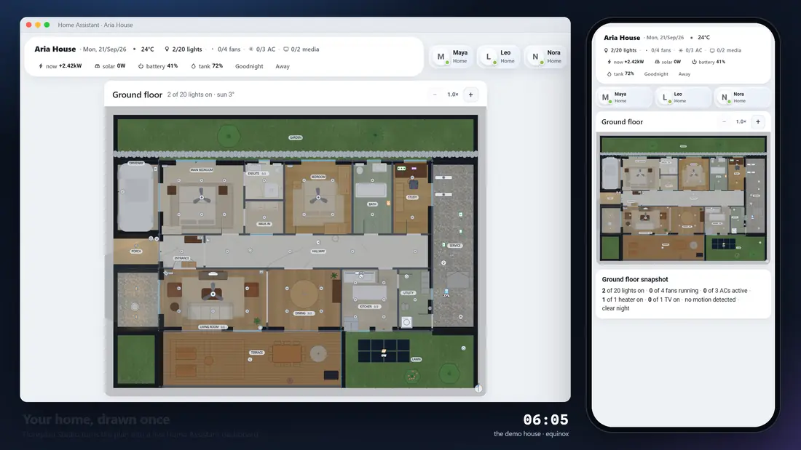

<div align="center">


### Draw your home. Bind it to Home Assistant. Get a live dashboard.

An interactive top-down floor-plan editor and dashboard generator, delivered as
a custom Home Assistant app. The plan you draw and the dashboard you ship are the
same renderer — not a design tool that exports to something else.

[](https://my.home-assistant.io/redirect/supervisor_store/?repository_url=https%3A%2F%2Fgithub.com%2Fkarthikbabuks%2Ffloorplan-studio)

[](LICENSE)
[](floorplan_studio/CHANGELOG.md)
[](#status)
[](#status)
[](THIRD_PARTY_NOTICES.md)
[](floorplan_studio/Dockerfile)
[](floorplan_studio/config.yaml)

**[▶ Try the live demo](https://karthikbabuks.github.io/floorplan-studio/demo/)** ·
[Read the help guide](https://karthikbabuks.github.io/floorplan-studio/) ·
[Browse all types](https://karthikbabuks.github.io/floorplan-studio/library.html) ·
[Explore materials](https://karthikbabuks.github.io/floorplan-studio/materials.html#material-gallery)

<a href="https://karthikbabuks.github.io/floorplan-studio/demo/"></a>

<sub>The dashboard Floorplan Studio generates, filmed from the
<a href="https://karthikbabuks.github.io/floorplan-studio/demo/">live demo</a>: an
invented house through one day, a desktop and a phone sharing one house. Every
tap runs the real card's own code; the captions, clock and cursor are the only
things added. <a href="./docs/hero.mp4">Watch it as a sharper video</a>.</sub>

</div>

---

## Status

> **Alpha — tested on a real home, and ready to try.** App version 0.0.1.
> Floorplan Studio runs on a real Home Assistant OS installation: a
> multi-storey home with close to two hundred bound entities, drawn in the
> editor, generated into a dashboard and used from desktop browsers and the
> Android companion app. The editor behind Ingress, the MCP endpoint and its
> Home Assistant token check, the dashboard installer with its ownership stamps
> and backups, and the three dashboard cards have all been exercised there —
> not only in the test suite — and what that turned up has been fixed.
>
> It is still an alpha, and `experimental` in Home Assistant's own terms. One
> home is one home: other installations, browsers and ways of drawing a house
> will find things that one did not, and workflows may change before 1.0.
> **Install it and draw your house** — and generate to a new dashboard path
> rather than over one you rely on.
>
> (Home Assistant's own `stage:` field offers `stable`, `experimental` or
> `deprecated` — no "alpha" — so `config.yaml` declares `experimental`, which is
> the closest of the three. The two words describe the same thing.)

| | |
|---|---|
| ✅ **Proven on a real installation** | The Ingress editor; MCP over IPv4 and IPv6 with Home Assistant tokens; generating a dashboard, and regenerating it in place with a backup first; the house, plan and floor cards on a desktop GPU and on a phone |
| 🧪 **Covered by the suite, lighter real-world use** | Reopening a dashboard from its embedded project; MCP over TLS; legacy import; the headless `/app-api` (off by default) |
| ⏳ **Not done yet** | Multi-architecture release builds and image signing; a complain-mode AppArmor audit; a second real home |

## Try it before you install it

The **[live demo](https://karthikbabuks.github.io/floorplan-studio/demo/)** is the
dashboard this app generates, for an invented house, running in your browser
against a stand-in Home Assistant. Drag the time of day and watch the sun move,
tap a lamp, open a room's popup, run a scene. Nothing in it reaches a real
house — and it is built from the same card bundle the app installs, so what it
does is what your dashboard does.

## What you get on the dashboard

|  | |
|---|---|
| 🗺️ **The plan, live** | Lamps pool light where they hang and by their wattage, fans turn at their real speed, doors read open from their contact sensors, blinds sit where their cover reports, and daylight falls through each window from the real position of the sun. |
| 🏠 **The house card** | Who is home, what is on and the readings that matter — solar, battery, a water tank — in one bar, with chips that exist only while something is happening (the washer mid-cycle) and your own scene buttons. One bar on a wide screen, a rail beside the plan on a tablet, a row on a phone. |
| 🚪 **A popup for every room** | Tap a room's name for its brightness, a button per fixture type, each light and device, and the scenes and scripts named after that room — found by name, so the one you add next month joins by itself. On a phone it rises as a bottom sheet. |
| 📝 **A snapshot per floor** | One sentence under each plan — *7 of 20 lights on · 1 of 4 fans running · no motion detected · clear night* — and every phrase opens what it counted. |
| 👆 **Taps that answer at once** | A tap paints its result immediately and pulses until Home Assistant confirms it; optional retries for a mesh that swallows commands. A text label bound to a light can never switch it. |
| 🔍 **Zoom like a map** | Pinch, Ctrl-scroll or − and +. The whole floor fits the screen on a phone and on a wall tablet alike, and a desktop graphics card draws it without tearing. |
| 🎨 **Looks like your dashboard** | Follows your Home Assistant theme, light or dark, or pin one; add your own CSS, which stays inside these cards. |
| 📦 **One press, one resource** | Generate writes one card resource for every floor and a dashboard with a tab per floor. No HACS, nothing copied into `config/www/`. |

## What you get in the editor

|  | |
|---|---|
| 🏠 **Multi-floor plans** | Rectangular, polygonal and curved rooms, doors, windows, openings, gates, walls, railings and boundary segments. |
| 🛋️ **A library that looks like the thing** | 261 devices, fixtures and furniture, each drawn as the object it is — a bed has pillows, a hob has burners, a 3-gang wall switch has three rockers — rather than a labelled dot. |
| 🪵 **Floors with character** | 178 stock finishes across 14 material groups: grained timber, herringbone, mitred chevron, basket parquet, marble, terrazzo, hexagonal and patterned cement tiles, woven fibres, concrete, resilient flooring and outdoor paving. Edit the pattern, palette, scale and reflectance. The same finishes paint every horizontal surface — room floors, stair treads and landings, and the tops of walls. |
| 🎨 **Materials for every item** | 80 colour schemes for metal finishes, timber, upholstery, stone, paint, natural fibres and foliage. Apply colours independently of shape, or create project-owned schemes that travel with your exported plan. |
| 🔌 **Bound to your entities** | Pick an entity per marker, or type one offline. A fan's built-in light is part of the fan; each gang of a wall switch reads its own entity; a text label prints any state or attribute. |
| ☀️ **Daylight and lamps modelled** | Real solar position for your coordinates, light through each opening by what it lets through, artificial light from wattage and lumens, and a night that each lit lamp cuts into. |
| 🏷️ **Room names where you want them** | Drag a room badge inside or beside its room and resize it; name and live count scale together. Automatic placement steps aside for the fan in the middle of the room. |
| 🤖 **Drivable by an AI** | An MCP endpoint, so a model can draw and edit the plan while your editor updates live — working object by object through stable ids rather than rewriting the file. |
| 📌 **Say where you mean** | Pin a review note to a floor, a room, an item, an opening, a wall or a bare point. Notes follow what they are attached to, an assistant reads them back with the room around them, and they never reach Home Assistant. |
| 🖐️ **Mouse, trackpad or tablet** | Pinch and two-finger pan on touch, trackpad pinch, `Space` or middle-drag on a mouse, zoom that holds the point you are pointing at, and a drag that latches to the axis it started along. On a narrow screen the rail and inspector become drawers. |
| 📖 **Help with pictures** | Every panel's **?** opens help written against the same registries the editor uses. The [help site](https://karthikbabuks.github.io/floorplan-studio/) adds figures drawn by the renderer itself — daylight at four hours, lamps at three wattages, finishes, walls, doors, blinds — and the live demo, all regenerated whenever the renderer changes. |
| 📦 **No runtime dependencies** | No third-party runtime packages or lockfile. The production image is distroless, with no shell or package manager. |

<div align="center">


<sub>The same invented house as a still, at golden hour. Not a mockup — the
renderer's own output, and the same code that draws your editor and your
dashboard. <code>node tools/make-showcase.js --test</code> asserts the plan is
still a building, down to "no door opens onto the furniture".</sub>

</div>

## A material library, built into the framework


These are the floor generators themselves, shown at a consistent scale—not
stock photography. The [complete material gallery](https://karthikbabuks.github.io/floorplan-studio/materials.html#material-gallery)
shows every shipped floor finish and item colour scheme, with its registry key.

- **Choose a material and a laying pattern.** Chevron has mitred ends;
  herringbone has rectangular boards; basket parquet alternates its blocks.
  Hexagons, floral cement tiles, woven fibres and rubber studs have distinct
  geometry rather than being renamed square tiles.
- **Make it your own.** Tune grout, tile dimensions and variation, wood grain,
  marble veins, terrazzo chip colours and size, thread spacing or board angle.
  Duplicate a finish in the editor and adjust it without writing code.
- **Carry the result through.** The editor, SVG export, preview and generated
  dashboard use the same surface generators. Seeded textures stay stable on
  repaint; new stock finishes and option controls reach existing registries
  without replacing custom entries.

Materials are stylised for readable floor plans. Reflectance values are
adjustable lighting-model estimates, not measured product specifications or
a simulation of polished reflections.

## From a drawing to a home you can control

1. **Draw** floors, rooms and boundaries; place recognisable furniture and devices.
2. **Style** the home with material finishes, shape variants and colour schemes.
3. **Bind** Home Assistant entities and configure room controls, shortcuts and summaries.
4. **Preview and generate** a Lovelace dashboard using the same drawing engine.

The app also backs up dashboard configuration, stamps its own deployments and
can reopen an embedded editable project. See [reopening a generated dashboard](#reopening-a-generated-dashboard)
for the portability and ownership rules.

### Whatever you are drawing on

The editor is meant to be equally good with a mouse and keyboard, with a
trackpad, and with a finger on a tablet — which means a few things behave
differently on each, on purpose.

| | Mouse and keyboard | Trackpad | Touch |
|---|---|---|---|
| Move around a zoomed-in plan | middle-drag, or hold `Space` | two-finger scroll | one finger on empty floor, or two fingers anywhere |
| Zoom | `Ctrl`/`Cmd`+wheel | pinch | pinch |
| Move something | drag it | drag it | tap it, then drag it |
| Select several | `Shift`-click, or drag a box | `Shift`-click, or drag a box | **Multi**, then tap each |

Zooming holds whatever you were pointing at, so zooming in twice and carrying
on is a reasonable thing to do. On a touch screen a plain drag moves the plan
rather than whatever is under your finger, unless that thing is already
selected: a finger cannot hover to see what it is about to pick up, and every
attempt to look at the far end of the house would otherwise move a room a few
inches under the hand hiding it.

Where there is no keyboard, **S** in the top bar turns the keyboard's commands
into buttons — undo, redo, duplicate, delete, turn, resize, nudge, the five
tools — and below about 900 px the tool rail and the properties inspector
become drawers (**☰** and **▤**, or double-tap what you selected) so the plan
gets the whole window.

All of it is one catalogue — [`app/lib/input-actions.js`](floorplan_studio/app/lib/input-actions.js)
— read by the keyboard, the buttons, the shortcuts dialog and the help, so the
editor cannot describe a gesture it does not implement. It used to: every Pan
tooltip said `Space` panned the canvas, and nothing read the space bar.

## Install

Open **Settings → Apps → Install app**, add this repository from **⋮ →
Repositories**, or press the button above. Then install **Floorplan Studio**
and open **Floorplan** in the sidebar. The editor is served through Ingress,
so there is no separate login and no port to open for it.

Per-option configuration is in
[the app's README](floorplan_studio/README.md) and
[DOCS.md](floorplan_studio/DOCS.md).

## This repository

A Home Assistant app repository, in the layout
[`home-assistant/apps-example`](https://github.com/home-assistant/apps-example)
documents:

```
repository.yaml            what Supervisor reads first
floorplan_studio/          the app — the only thing installed
  config.yaml  Dockerfile  apparmor.txt  icon.png  logo.png
  app/  samples/  translations/
  README.md  DOCS.md  CHANGELOG.md  SKILL.md
  LICENSE  NOTICE  THIRD_PARTY_NOTICES.md
test/  tools/  branding/  docs/    development material, never installed
```

The three root notice files are canonical. Their committed copies inside
`floorplan_studio/` are generated with `npm run sync:licenses`: Home Assistant
and a direct local build use **that folder as the complete Docker context**, so
the image cannot `COPY ../LICENSE`. The root copy is what GitHub detects; the
app copy is what travels inside the image. Nobody needs to edit both, and the
suite fails if a sync was forgotten.

Ignored paths are part of the boundary, not repository clutter:

- `floorplan_studio/app/data/` is runtime state mounted at `/data` in Home
  Assistant and may contain a user's plan;
- `fixtures/` is the developer's real-house fixture, while the committed
  `test/house/` and the demo house are entirely synthetic;
- `repo-memory/` holds private working context and a comparison with a separate
  system, not public product documentation;
- `.env*`, keys/certificates, caches, logs and editor metadata are local or
  sensitive by definition. `.env.example` is the deliberate exception.

> **Not a HACS repository.** HACS distributes integrations, dashboard plugins,
> themes, AppDaemon apps, python scripts and templates —
> [not apps](https://www.hacs.xyz/docs/publish/). Apps install by adding a
> repository URL to the Supervisor store, which is what the button above does.

Before pushing:

```bash
npm run sync:licenses       # after changing a root notice
node tools/check-repository.js
```

It verifies the layout, that the app folder matches its slug, that every file
Supervisor and the store read is present, that every `COPY` in the Dockerfile
names something actually inside the build context, and that nothing private sits
in the installable folder.

## Verified capability

Implemented and covered by the local suite:

- multi-floor projects with rectangular, polygonal and curved rooms;
- doors, windows, gates, openings, coverings, walls, railings, and boundary segments;
- configurable flooring, furniture, fixtures, devices, entity-value labels, marker variants,
  built-in lights, one- and two-axis resizing, rotation, and coverage cones;
- flooring materials on every horizontal surface — room floors, stair treads and
  landings, and wall tops with their own widths;
- room ids derived from room names, with every floor-local reference rewritten in
  one undo step and automatic renaming disabled once a plan has been deployed;
- targeted review notes with lifecycle, undo, MCP read/edit, and exclusion from
  everything written to Home Assistant;
- one shared hit-test for the editor and the card, a canvas context menu, and an
  automatic axis lock for straight drags;
- an editor save that names the version it started from, and merges object by
  object when the plan moved on underneath it;
- entity binding with an offline manual-entry path;
- live-state rendering, daylight, artificial-light modelling, light zones,
  themes, motion, and responsive interaction;
- configurable room control surfaces, shortcuts, scenes and scripts found by
  room name, automations, helpers, the house card and the floor snapshot;
- optimistic taps with an in-flight pulse and optional retries;
- generation of a Lovelace dashboard with one view per floor;
- a shared renderer for the editor, SVG export, preview, dashboard card, help
  figures and live demo;
- project persistence, rolling project backups, legacy import/export, and
  dashboard-config backup logic;
- browser-side Home Assistant WebSocket, OAuth, provenance, discovery, and
  project round-trip primitives, shared with (not duplicated by) the app's
  own writer;
- ownership-enforced dashboard writes and per-project card resources, so a
  second Floorplan Studio dashboard cannot silently overwrite the first;
- app discovery and reopen of its own previously-deployed dashboards
  (Import… → From Home Assistant).

### Running the suite

```bash
node test/verify.js
```

The suite checks every shipped type, finish and colour scheme, the renderer,
registry upgrades, generated documentation — including every help figure and
the live demo's card bundle — and the dashboard pipeline. Optional integration
checks print their own prerequisites when skipped.

It runs against `test/house/` — a five-floor synthetic building that is
committed, so a clone runs everything with no setup. That house is **invented**,
geometry included, and generated by `node tools/make-test-house.js`; the suite
pins the committed copy to its generator. Everyone therefore runs the same
assertions against the same building, which is the point — a suite whose result
depends on whose house you happen to have is not a suite.

Two checks need something the repository deliberately does not carry:

- **MCP over HTTPS** needs a certificate and a private key. `*.pem` is
  gitignored wholesale — a private key in a public repository is a private key
  on the internet, and a throwaway one in `test/` is what stops anyone noticing
  the day a real one lands beside it. Create them and the test runs:

  ```bash
  openssl req -x509 -newkey rsa:2048 -nodes -keyout test/fixtures-tls/test-key.pem -out test/fixtures-tls/test-cert.pem -days 3650 -subj "/CN=localhost"
  ```

- **The legacy import/export round-trip** needs `FPS_LEGACY_DIR` pointing at a
  directory of hand-written floor specs.

### Testing against your own home

Once you have drawn your real plan there is a third, optional section that runs
against it: does the validator accept it, does every library type it uses still
resolve, does every floor render without warnings, can a dashboard and a card be
built from it. That is the check worth having, because it exercises a building
nobody designed the renderer around.

Drop a `*.project.json` into `fixtures/` — gitignored precisely so a real home
can live there and never be committed — or point `FPS_MY_HOUSE` elsewhere. It
reports counts, and names a floor or a type on failure, never a room: pasting
the output into an issue does not paste your home into it.

Passing the suite validates the data model, renderer, card builder, safety
guards, and browser-client primitives. It does not replace testing on a real
Home Assistant — which is why the table under [Status](#status) says which parts
have had that.

## Delivery

### Home Assistant app

The app packaging, Ingress-aware server, persistent `/data` store, editor,
card preview, and Lovelace writer exist, and have run together on a real Home
Assistant OS installation. The production image uses the current Node.js 24
LTS line on a Debian 13 distroless runtime: it has no shell, package manager or
third-party npm modules.

Node.js 24 supplies the stable global `WebSocket` used by the Lovelace writer.
The image supports `amd64` and `aarch64`, including Raspberry Pi 3/4/5 and Zero
2 W installations running 64-bit Home Assistant OS. Legacy 32-bit `armv7` is not
supported by the Node 24 distroless runtime.

This is an **alpha you can use**, not a stable public app. It has been proven
on one home, not on many; release builds, signing and the AppArmor audit below
are still to come. Install it as an experimental app, and generate to a new
dashboard path rather than over one you depend on, so an alpha never stands
between you and your own house.

## Driving the editor with an AI (MCP)

The app exposes a [Model Context Protocol](https://modelcontextprotocol.io)
server so an AI can draw and edit the plan instead of a human dragging shapes,
with the open editor updating live as it works.

**Connect** (Claude Code, as an example — any Streamable HTTP MCP client works
the same way):

```bash
claude mcp add --transport http floorplan-studio \
  http://homeassistant.local:8099/mcp \
  --header "Authorization: Bearer <a Home Assistant long-lived access token>"
```

Get the token from your own Home Assistant profile (Settings → your profile →
Security → Long-lived access tokens) — nothing is generated or stored by this
app itself. The token is checked by asking Home Assistant Core's own
`GET /api/` whether it is valid — directly, at `http://homeassistant:8123`,
because Supervisor's proxy accepts only the app's own token — so revoking it in
Home Assistant revokes MCP access in the same instant. In offline development (no Home Assistant configured at
all) any caller is let through, matching how the entity picker degrades.

**Why not through Ingress:** Ingress authenticates by a per-browser-session
cookie only Home Assistant's own frontend can mint; a generic MCP client only
knows how to send a URL plus static headers and has no way to complete that
handshake. `/mcp` is served on the app's own published port instead
(`config.yaml` publishes `8099/tcp` for exactly this) — everything else the
app serves still requires the Ingress proxy, unchanged.

**The guide comes to the client, not the other way round.** On connect the
server returns MCP `instructions`, which Claude Code, Cursor and Codex all put
into the model's context with no tool call and no setup. The full working
guide is then available three more ways — as the resource
`floorplanstudio://guide`, as the prompt `floorplan_studio_guide`, and as the
`get_guide` tool — all serving the same `SKILL.md` the add-on ships, which a
filesystem-aware client can also load directly as a skill.

**Tools:** `get_contract` (read this first — the project schema and which tool
reaches what), `get_project`, `find_objects`, `get_registry`, `list_library`,
`list_entities` and `get_help` to read; `edit_collection` (floors/rooms/items/openings/
boundaries/annotations — add/update/remove), `edit_batch` (many of those in one
write), `edit_settings` (other project settings, by dot path) and
`edit_registry` (shared library, flooring, theme, boundary and control fields,
by literal key path) to write; `list_annotations` for the review notes a human
pinned to the plan; `validate_project` on demand (every write already runs the
same check and refuses to save on error); `preview_dashboard` to see what
Generate would produce; and `install_dashboard`, which actually writes to Home
Assistant and is **only advertised when the app option
`mcp_allow_dashboard_install` is turned on** (off by default) — an AI can draw
and edit freely from the moment it connects, but cannot touch a live dashboard
until a human opts in.

**Binding is not guesswork.** `list_entities` hands a model the house's real
entity catalogue — the identifiers Home Assistant dashboards bind to, rather
than its physical-device registry. It is the same privacy-filtered list the
editor's picker uses. Entity ids, friendly names and current states are visible
to the authorized assistant; `person`, `device_tracker` and `zone` are dropped
wholesale and only an allowlist of attributes leaves the app, so coordinates and
location-tracking entities are excluded. Filter by domain, device class, free
text, current state, or `bound: "no"` for everything not yet placed; each
library type declares the domains it binds to, so the loop is `list_library` →
`list_entities` → `edit_collection`. Results are bounded and paged, so even a
large installation can be read completely. With no Home Assistant credentials
it answers `offline` and an empty list rather than failing.

**A plan is a big document, and nothing has to read all of it.** Every floor,
room, item, opening, wall and note carries a stable id, and the server is built
around addressing them rather than shipping the house back and forth:
`get_project({outline:true})` is the index — floors, room names, a census of
what is on each — and `find_objects` returns just the objects a job touches,
filtered by type, kind, room, bound entity, free text or distance from a point.
An `edit_collection` update is a patch, not a replacement, so changing one lamp
never means reading or rewriting the other three hundred. `edit_batch` applies
up to 200 of those as one validation and one save, all-or-nothing.

**Live view:** the editor, if open, updates over one Server-Sent Events
connection as soon as anything changes the project — from this MCP server or
from another browser tab. With no unsaved edits it simply takes the new plan;
with some, it merges your edits into it object by object rather than silently
overwriting either side.

**Turning MCP off:** the app option `mcp_enabled` (default on) is the full
switch — set it to off and `/mcp` answers 404 on every port, as if `mcp.js`
were never loaded.

**Reaching MCP from outside your LAN:** the published port is plain HTTP by
default, fine for a client on your own network. If you forward that port
through your router to reach it from elsewhere, set the app options
`ssl_cert` and `ssl_key` to a certificate/key pair already in Home Assistant's
own shared `/ssl` folder (or an absolute path) — Floorplan Studio then ALSO
serves MCP over HTTPS on `mcp_ssl_port` (default `8443`), a dedicated port
that serves nothing but `/mcp`. The plain-HTTP port keeps working unchanged;
this only adds an encrypted option, so your Bearer token isn't sent in
cleartext once it leaves your home network. The host-side numbers for both
ports are themselves remappable from Settings → Apps → Floorplan Studio →
Configuration → Network, a stock Supervisor feature for any app that
declares `ports`.

## Reopening a generated dashboard

Reopening must use the editable Floorplan Studio project, not attempt to
reverse-engineer arbitrary Lovelace dashboards.

The implemented contract is:

- every Floorplan Studio deployment writes a small `floorplan_studio`
  provenance stamp;
- when the user enables portable editing, the stamp also carries the complete
  editor project;
- app deployments use a versioned stamp schema;
- discovery lists only Floorplan Studio dashboards;
- opening a dashboard without an embedded project explains that it can be
  redeployed but not reconstructed losslessly;
- the editor refuses to overwrite an unstamped dashboard unless the user
  explicitly chooses to take it over after a backup.

The app implements this contract end to end: `GET /api/dashboard/discover`
lists what it has deployed by reading each dashboard's stamp back, and
`POST /api/dashboard/reopen` pulls one's embedded project into the editor
(Import… → *From Home Assistant*). A project remaining in the app's `/data`
is local persistence; it is not the same as
pulling the project back from Home Assistant, which is what discovery and
reopen do.

## Development

Run the app server locally:

```bash
node dev-server.js
```

Build the production image from the repository root while keeping the same
context Home Assistant uses:

```bash
docker build -t local/floorplan-studio floorplan_studio
```

The command starts at the root for convenience; `floorplan_studio/` remains the
context so the image is also buildable by Supervisor and as a copied local app.

Open <http://localhost:8099> and load the test house from **Import → Sample
projects**. The exact generated card is available at
<http://localhost:8099/preview.html>.

For read-only live entities during development, place a `.env` next to
`dev-server.js`:

```text
HA_URL=http://homeassistant.local:8123
HA_TOKEN=<long-lived token>
```

Without it, the editor remains usable offline and entity ids can be entered
manually.

Regenerate the committed artefacts after changing the renderer, the cards or a
fixture:

```bash
node tools/make-test-house.js      # test/house/, what the suite runs against
node tools/make-readme-image.js    # docs/hero-plan.svg, the older four-storey still
node tools/make-showcase.js        # docs/showcase-plan.svg, the demo house as a still
node tools/make-showcase.js --test # is the demo house still a building?
node tools/make-docs.js            # docs/: the help site, its figures and the live demo
node tools/make-gif.js             # docs/showcase.gif, the demo house through one day
node tools/make-hero.js            # docs/hero.webp and hero.mp4, filmed from the live demo
```

`make-test-house.js`, `make-readme-image.js`, `make-showcase.js` and
`make-docs.js` all have a `--check` mode, and the suite runs them, so a stale
artefact fails rather than lingering — the help figures and the demo's card
bundle included, which is why a change to the renderer or the cards is not
finished until `make-docs.js` has run.

The two animations are filmed rather than checked. `make-gif.js` rasterises its
frames with the Edge or Chrome already on the machine (`tools/rasterize.js`) and
encodes the GIF itself. `make-hero.js` drives one headless browser over the
Chrome DevTools Protocol, plays the live demo on a virtual clock so every frame
is exact, and needs `ffmpeg` on the PATH for the video and the animated image. Neither is a
dependency of anything the app runs.

Serve the browser-based branding exporter when changing logo assets:

```bash
node tools/serve-static.js
```

`package.json` declares Node.js `24.x` and intentionally has no dependencies.
The application uses Node built-ins and repository-owned browser/rendering
libraries only. Runtime OS and Node security updates arrive through refreshed
`gcr.io/distroless/nodejs24-debian13` images; rebuild releases regularly.

## Safety model

The scope of every claim below is **the app process**. The dashboard it
generates is a separate thing running somewhere else, under someone else's
credentials — see "The generated card is not the app" at the end of this
section.

- `floorplan_studio/app/lib/ha.js` is the app's read-only state client and hardcodes GET.
- `floorplan_studio/app/lib/ha-write.js` is the app Lovelace writer.
- The writer contains no Home Assistant service-call command.
- The default dashboard is always refused.
- Project writes are atomic and rolling backups are retained.
- Dashboard replacement is backed up and read back after save.
- Person, device-tracker, and zone location data is excluded from the browser
  state map; the house card's people picker receives person ids and names only.
- `floorplan_studio/app/lib/mcp.js` is the MCP server. It has no service-call command either —
  it reads/writes the project file and, if the option is on, one Lovelace
  dashboard through the same `ha-write.js` path above, nothing else. It is
  reachable outside Ingress (see "Driving the editor with an AI") but not
  outside auth: every request needs a Bearer token Home Assistant itself
  confirms is valid. `install_dashboard` is the one MCP tool that reaches
  Home Assistant, and it is not even listed among the tools an MCP client
  sees unless `mcp_allow_dashboard_install` is turned on.

- `floorplan_studio/app/lib/app-api.js` is the headless surface — `/app-api/v1`
  REST and its WebSocket, for a native or remote client that cannot complete
  Ingress's cookie handshake. Gated by its own option
  `headless_endpoints_enabled`, default off, and deliberately not tied to
  `mcp_enabled`: an AI client and a phone are different callers that merely
  share a listener. It is **not a Home Assistant proxy** — it answers what the
  plan looks like and never lends the app's supervisor credential to a caller,
  so it cannot turn anything on and cannot show an entity Home Assistant would
  not show that caller. Every request needs a Home Assistant-confirmed Bearer
  token; writes additionally require an admin token.

- `floorplan_studio/app/lib/provenance.js` is the shared ownership contract: every write is
  stamped, and an existing dashboard at the target path is only overwritten if
  its own stamp names that same path (`assertOwnedConfig`). The very first
  write to an unrelated existing dashboard still succeeds after a backup —
  there is nothing to check yet — but every write after that is
  provably Floorplan Studio's own prior work.

The live demo on the help site is outside all of this: it is a static page with
a stand-in Home Assistant written in JavaScript, and it talks to nothing.

### The generated card is not the app

"Read-only by construction" describes the app process. It does **not**
describe the dashboard card the app writes, and conflating the two would
overstate the guarantee.

The card is an ordinary Lovelace custom element. Tapping a light on the plan
turns that light on — `card-runtime.js`'s `call()` and `card-overview.js` reach
`hass.callService`, exactly as Home Assistant's own tile and button cards do.
That is the point of the card; a floor plan you cannot press is a picture.

The distinction that matters is *whose* credentials do it:

- The **app** holds a Supervisor token and can only GET with it. No amount
  of tapping in the editor reaches a service call, and the card **preview**
  inside the editor logs its taps rather than sending them.
- The **card** holds no credentials at all. It is served as a `module` resource
  into a browser that is already signed in, and it calls services through the
  `hass` object Home Assistant hands every card — so it acts as the person
  looking at the dashboard, is bounded by that person's own permissions, and
  is visible in their logbook under their own name.

So the app cannot unlock your door, and the dashboard it generates can — to
whatever extent the person viewing it already could. Both statements are
intended.

## Before public publication

The app carries the required metadata, Node.js 24 image labels,
Ingress lifecycle/watchdog settings, option translations, presentation assets,
the Apache-2.0 `LICENSE`, `NOTICE` and `THIRD_PARTY_NOTICES.md`, and an
AppArmor profile, and it has run under all of them on a real Home Assistant OS
installation. Before a stable public release it still needs:

- multi-architecture build/release automation and image signing;
- **an audit of `apparmor.txt` against the kernel log in complain mode.** The
  profile is written, shipped, and tighter than the template in the Home
  Assistant documentation — no `file,` blanket grant, no capabilities, five
  named directories, and `/data` the only writable one, because a distroless
  image has no shell or s6 to accommodate. The app has installed, started and
  served its editor, MCP and dashboard installs under it; what is not yet done
  is confirming nothing it needs is being denied quietly. `DOCS.md` → "The
  AppArmor profile" has the complain-mode procedure;
- testing beyond one home: on both `amd64` and `aarch64`, across backup and
  restore, and by people whose houses the renderer was not written against.

`CONTRIBUTING.md` covers contributions (Apache-2.0 §5, no CLA), the
zero-dependency rule, house style, and the support policy. `SECURITY.md`
explains how to report a vulnerability without disclosing Home Assistant
credentials or household details.

## Versioning

Floorplan Studio versions its app, project schema, renderer, and generated card
together.

- `0.x` — development releases; storage migrations and workflow changes remain
  possible and must be documented.
- `1.0.0` — only once app deployment, reopen/edit/redeploy, ownership
  protection and public packaging have come through testing on more homes than
  one.
- every release must keep `config.yaml`, the runtime-reported version, and
  `CHANGELOG.md` in sync.

The separate hand-generated dashboard has its own lifecycle and is not assigned
a Floorplan Studio version.

## Documentation map

- [The live demo](https://karthikbabuks.github.io/floorplan-studio/demo/) — the
  generated dashboard for the invented demo house, on a stand-in Home Assistant.
  `tools/make-docs.js` builds it into `docs/demo/` from the same card bundle the
  app installs, with `tools/demo-hass.js` as the stand-in.
- [The help site](https://karthikbabuks.github.io/floorplan-studio/) — the
  published guide. Its topic pages are generated by `tools/make-docs.js` from the
  same help topics the editor shows behind its **?** buttons, so the site and
  the app can never drift apart. Its figures are declared in
  `tools/help-figures.js` and drawn by the renderer from the demo house into
  `docs/figures/`. GitHub Pages serves it from `docs/`.
- [The material gallery](https://karthikbabuks.github.io/floorplan-studio/materials.html#material-gallery)
  — all stock flooring renders and colour palettes, in the same Pages navigation,
  theme and search. `tools/make-docs.js` hosts the gallery using material
  figures from `tools/make-material-gallery.js`.
- [`floorplan_studio/DOCS.md`](./floorplan_studio/DOCS.md) — detailed editor
  usage; Home Assistant shows this in the app's Documentation tab.
- [`floorplan_studio/CHANGELOG.md`](./floorplan_studio/CHANGELOG.md) —
  version history.
- [`floorplan_studio/SKILL.md`](./floorplan_studio/SKILL.md) — the agent-facing
  guide. It ships inside the image and is what MCP's `get_guide` serves, so a
  model driving the editor reads the same document a person would.
- [`CONTRIBUTING.md`](./CONTRIBUTING.md) — contribution terms, the
  zero-dependency rule, house style, and the support policy.
- [`SECURITY.md`](./SECURITY.md) — how to report a vulnerability privately.
- [`THIRD_PARTY_NOTICES.md`](./THIRD_PARTY_NOTICES.md) — the full licensing
  inventory, including why the base image's LGPL components impose nothing on
  your own code.
- `floorplan_studio/apparmor.txt` — the app's AppArmor confinement; `DOCS.md` explains how to
  verify it.
- `branding/` — editable SVG sources for `icon.png` and `logo.png`; export them
  with `tools/export-branding.html` (see `DOCS.md`, "Branding").
- `docs/hero.webp` and `docs/hero.mp4` — the lead animation, filmed by
  `tools/make-hero.js` from the live demo.
- `docs/showcase-plan.svg` and `docs/showcase.gif` — the demo house as a still
  and through one day, generated by `tools/make-showcase.js` and
  `tools/make-gif.js`. Every entity id in it begins `demo_`, and its household is
  three invented first names.
- `docs/hero-plan.svg` — the older four-storey still, generated by
  `tools/make-readme-image.js`; kept because it shows multi-floor and stairs.

Working notes — implementation status, the data-model and rendering design, and
a feature comparison against the separate hand-written dashboard this was
modelled on — live in `repo-memory/`, which is not published. They describe
unreleased state and reference a private system, so they are kept as context for
future work rather than as documentation. A few source comments still cite them
by name; that is deliberate, and the files are one `git mv` from being public if
that ever becomes the right call.

## License

Copyright 2026 Karthik Babu.

Licensed under the Apache License, Version 2.0 (the "License"); you may not use
this file except in compliance with the License. You may obtain a copy of the
License at <http://www.apache.org/licenses/LICENSE-2.0>.

Unless required by applicable law or agreed to in writing, software distributed
under the License is distributed on an "AS IS" BASIS, WITHOUT WARRANTIES OR
CONDITIONS OF ANY KIND, either express or implied. See the License for the
specific language governing permissions and limitations under the License.

Floorplan Studio bundles no third-party source code: `package.json` declares no
runtime dependencies, there is no lockfile, and every app `require()` resolves to a file in
this repository or a Node.js built-in. The container image adds an unmodified
Node.js runtime and Debian base, each keeping its own licence and copyright
files inside the image. `THIRD_PARTY_NOTICES.md` is the full inventory,
including what the base image's LGPL and GCC-Runtime-Exception components do
and do not require.

Home Assistant is a trademark of the Open Home Foundation. This project is
independent and is not affiliated with, endorsed by, or sponsored by the Home
Assistant project.
